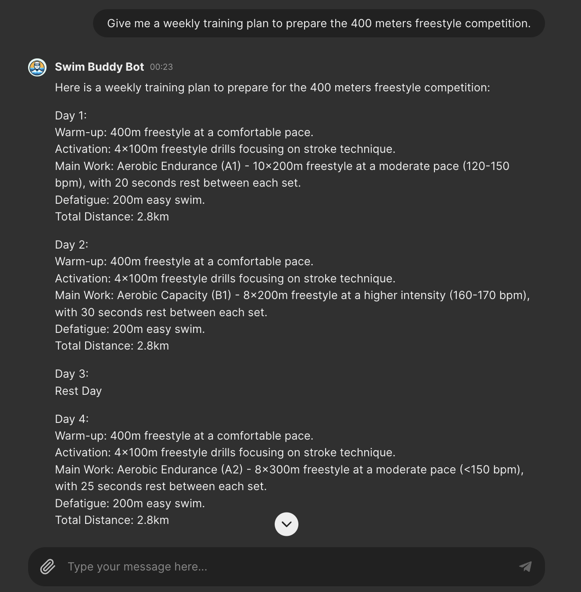

# Swim Buddy

## Introduction
Swim Buddy is a simple chatbot trained on a self written document about swimming training concept. 
This project is for educational purposes only and can be easily extended and improved.

## Setup
1. **Install the dependencies:
   ```bash
   pip install -r requirements.txt
   ```

2. **Configure Paths and Settings**:
- Set `DB_FAISS_PATH`, `DATA_PATH` and `OPEN_API_KEY` an as required for your project. 
  - `OPEN_API_KEY`: OpenAPI token needed to use GPT models (more info: https://platform.openai.com/docs/quickstart)
  - `DB_FAISS_PATH`: This is the path where you want to store your vectorstore db.
  - `DATA_PATH`: Path having your documents to be trained. (At present code supports only PDF documents)

## Usage
1. Train the Chatbot using your custom data:
   1. Put your PDF files under `DATA_PATH` path.
   2. Run:
      ```bash
      python ingest.py
      ```
   
3. Now run Chatbot and play around on the UI using below command:
   ```bash
   chainlit run chatbot.py
   ```
    For debugging purposes, you can use the command:
   ```bash
   chainlit run chatbot.py -w
   ```
## License
This project is licensed under the [GNU License](License).